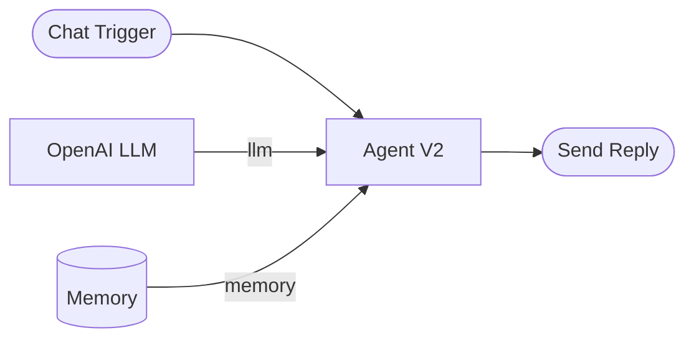

<!-- SECTION: overview -->
  # Memory

  > **Category:** Generative AI &amp; LLMs&nbsp;&nbsp;|&nbsp;&nbsp;**Type:** Memory Node

  Conversation memory held in the worker's own process. Connect it to an Agent
  V2 node's **Memory** handle and the agent can hold a real multi-turn
  conversation immediately, with nothing to set up.

  **It is lost on restart.** That is the whole trade: no database, no
  connection string, no durability.

### What it provides

| Capability | Provided | What it means |
|---|---|---|
| Conversation | Yes | The transcript the chat displays. |
| Checkpoints | Yes | An interrupted run resumes where it stopped. |
| Long-term recall | Yes | Values kept across conversations — in memory. |

All three are real while the workflow is up, and none of them outlive the
process.

### Use Cases

- Building and testing a conversational agent before choosing a database
- A demo that needs follow-up questions to work
- Any workflow where losing the history costs nothing

<!-- /SECTION: overview -->

<!-- SECTION: configuration -->
  ## Configuration

**This node has no settings.**

A lifetime dial was considered and rejected. A per-run scope behaves exactly
like connecting no memory at all, and the one thing that would make it
interesting — resuming mid-run after a crash — is precisely what RAM cannot
do, because the failure that makes resume valuable is the same failure that
wipes the memory. A dial with one meaningful position is worse than no dial.

Memory is capped per conversation to protect the worker, which every workflow
on that worker shares. A conversation that grows past the cap fails loudly
rather than taking the process down. That is a platform limit on a platform
resource, so it is not a user setting.

<!-- /SECTION: configuration -->

<!-- SECTION: inputs-outputs -->
  ## Inputs and Outputs

A memory node has **no data inputs or outputs**. It is a capability you attach
to an agent, not a step in a chain.

| Handle | Direction | Required | Description |
|---|---|---|---|
| **Memory** | Out | — | Connect to an Agent V2 node's **Memory** handle. |

<!-- /SECTION: inputs-outputs -->

<!-- SECTION: workflow-example -->
  ## Example

Nothing to configure. The agent now answers follow-up questions with the
conversation so far in view.

The builder shows **Memory is not durable** on the agent. That is a warning,
not an error — it is telling you exactly what this node is.

<!-- /SECTION: workflow-example -->

<!-- SECTION: troubleshooting -->
  ## Troubleshooting

### The conversation resets when the workflow restarts

Expected, and the defining property of this node. Switch to Postgres, Redis,
MongoDB or SQLite memory when you need history to survive.

### The conversation resets when nothing obviously restarted

The workflow probably moved to another worker — this memory lives in one
worker's process and does not travel. Deploys, scale-ups and recovery all
cause it.

### Memory is not durable

The builder's warning for this node. Correct while developing; switch backends
before relying on it in production.

### "In-process memory for thread ... is over the limit"

One conversation grew past the per-conversation cap. Connect a durable memory
node — the external backends have no such ceiling.

<!-- /SECTION: troubleshooting -->

<!-- SECTION: related -->
  ## Related Nodes

- **Agent V2** — the node this attaches to.
- **Postgres Memory**, **Redis Memory**, **MongoDB Memory** — durable and
  reachable from every worker.
- **SQLite Memory** — durable on one worker's disk, no external service.

<!-- /SECTION: related -->
