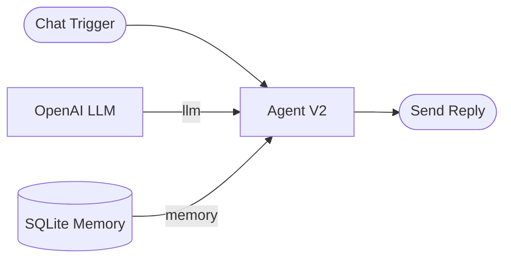

<!-- SECTION: overview -->
  # SQLite Memory

  > **Category:** Generative AI &amp; LLMs&nbsp;&nbsp;|&nbsp;&nbsp;**Type:** Memory Node

  Conversation memory kept in a single SQLite file on the worker's own disk.
  Connect it to an Agent V2 node's **Memory** handle.

  It survives a restart — the file is still there — but it is the only durable
  memory here that **one worker alone can reach**. Those are two different
  questions, and this node answers them differently.

### What it provides

| Capability | Provided | What it means |
|---|---|---|
| Conversation | Yes | The transcript the chat displays. |
| Checkpoints | Yes | An interrupted run resumes where it stopped. |
| Long-term recall | **No** | See *"Long-term memory is not available"* below. |

### Use Cases

- A single-replica deployment that needs history to survive a restart
- Local development where running Postgres or Redis is not worth the trouble
- An appliance-style install with one worker and no external database

<!-- /SECTION: overview -->

<!-- SECTION: configuration -->
  ## Configuration

| Field | Required | Default | Description |
|---|---|---|---|
| **Database File** | Yes | — | Absolute path on the worker's disk. |

### Database File

An absolute path, for example `/var/lib/fusion/memory.db`. The file and its
tables are created on first use, so the worker needs write access to the
directory — not just to the file.

Point it at a path that survives a container restart. A path inside the
container's writable layer is erased on every redeploy, which turns a durable
memory into a volatile one without anything reporting a change.

### There is no TTL setting

This backend offers none, and a field that silently does nothing is worse than
no field. Retention for a SQLite memory is deleting the file.

<!-- /SECTION: configuration -->

<!-- SECTION: inputs-outputs -->
  ## Inputs and Outputs

A memory node has **no data inputs or outputs**. It is a capability you attach
to an agent, not a step in a chain.

| Handle | Direction | Required | Description |
|---|---|---|---|
| **Memory** | Out | — | Connect to an Agent V2 node's **Memory** handle. |

<!-- /SECTION: inputs-outputs -->

<!-- SECTION: workflow-example -->
  ## Example

Configuration:

- **Database File:** `/var/lib/fusion/support-agent.db`

The builder shows **Memory is reachable from one worker only** on the agent.
That is a warning, not an error: the workflow runs, and the warning is telling
you what happens the day the workflow moves.

<!-- /SECTION: workflow-example -->

<!-- SECTION: troubleshooting -->
  ## Troubleshooting

### The conversation disappeared after a deploy

Expected. SQLite memory is a file on **one worker's disk**. When the workflow
is rescheduled onto another worker — on deploy, on scale-up, or on recovery —
the new worker cannot see that file. Use SQLite for a single-replica
deployment or while developing; use Postgres, Redis or MongoDB otherwise.

### "Long-term memory is not available"

Expected. The SQLite backend ships no long-term store, so this node offers
conversation history and checkpoints only. Connect a Postgres, Redis or
MongoDB memory node if the agent needs recall across separate conversations.

### "SQLite memory could not open ..."

The worker cannot write to that path. Check that the directory exists and that
the process user can write to it.

### Memory is reachable from one worker only

The builder's warning for this node, and it is correct rather than a
misconfiguration. Acknowledge it on a single-replica deployment, or switch
backends before scaling up.

<!-- /SECTION: troubleshooting -->

<!-- SECTION: related -->
  ## Related Nodes

- **Agent V2** — the node this attaches to.
- **Memory** — in-process memory, for when durability is not needed at all.
- **Postgres Memory**, **Redis Memory**, **MongoDB Memory** — durable *and*
  reachable from every worker.

<!-- /SECTION: related -->
